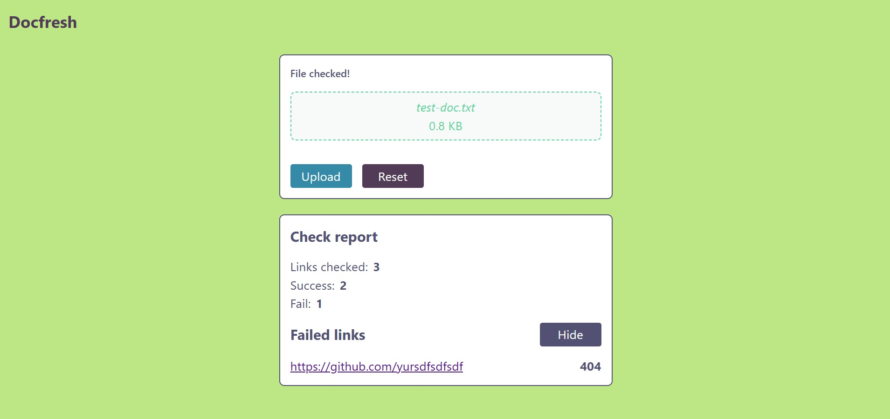

# Docfresh



App for checking TXT files for a incorrect links. User uploads document file and gets file-check report.

## Features

- Allowed formats: TXT, PDF, DOCX
- Built with React, TypeScript, Express.js
- Green design with https://coolors.co/palette/bce784-5dd39e-348aa7-525174-513b56
- Use [multer](https://www.npmjs.com/package/multer) for file middleware

## API

- POST `/api/upload`

## Local run

Prerequisites:

- Node.js (v20 or higher) installed on your machine.

1.  **Clone the repo:**

    ```bash
    git clone https://github.com/yurirodnov/doc-fresh.git
    ```

    or via SSH

    ```bash
    git clone git@github.com:yurirodnov/doc-fresh.git
    ```

2.  **Go to a back directory:**
    ```bash
    cd doc-fresh/back
    ```
3.  **Install dependencies:**
    ```bash
    npm install
    ```
4.  **Run the dev server:**
    ```bash
    npm run dev
    ```
5.  **Repeat 3, 4 for "front" directory**

6.  **Open the link shown in the terminal (usually `http://localhost:5173`)**.

7.  **Build for production (optional)**:
    ```bash
    npm run build
    npm run preview
    ```
